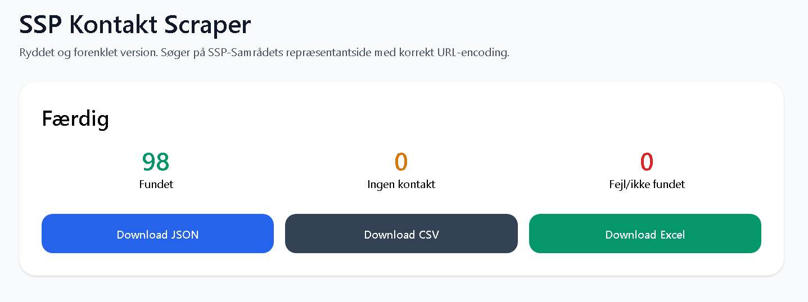

# SSP Kontakt Scraper

Et lille Flask-baseret værktøj, der søger kommune for kommune på SSP-Samrådets repræsentantside og eksporterer resultater som JSON, CSV og Excel. Til brug for programmører der ønsker at bruge dette, for at beskytte børn og unge i forbindelse med chat, hvor mistrivsel opdages af AI chat bot. 

Klik billedet for at hente DEMO VIDEO

[](demo.mp4)

## Hvad den gør

Applikationen gør dette for hver af de 98 kommuner:

1. bygger en søge-URL med korrekt URL-encoding, så `æ`, `ø` og `å` virker
2. henter HTML fra SSP-Samrådets side
3. finder kontaktblokke med `mailto:` og `tel:`
4. udleder navn, titel, e-mail og telefon
5. normaliserer output til en fast JSON-struktur
6. gemmer resultatet som:
   - `ssp_kontakter.json`
   - `ssp_kontakter.csv`
   - `ssp_kontakter.xlsx`

## Forventet køretid

For alle 98 kommuner er den forventede samlede køretid cirka **1 minut og 15 sekunder**. Det er forventet adfærd og ikke en fejl.

Køretiden kommer primært fra:
- 98 HTTP-requests
- HTML-parsing for hver kommune
- en lille pause mellem requests for at være skånsom mod kildesitet

## JSON-format

Hver kommune gemmes i et objekt i denne stil:

```json
{
  "id": "koebenhavn-ssp",
  "municipality": "København",
  "region": "Region Hovedstaden",
  "website": "https://www.kk.dk",
  "sspPage": "https://www.kk.dk/ssp",
  "contacts": [
    {
      "name": "SSP Koordinator",
      "email": "ssp@kk.dk",
      "phone": "33 66 33 66",
      "title": ""
    }
  ],
  "status": "found",
  "sourceType": "official",
  "verificationStatus": "auto-validated",
  "verification": {
    "sourceLooksOfficial": true,
    "hasContact": true,
    "hasEmail": true,
    "hasPhone": true,
    "domainMatchesMunicipality": true,
    "scrapeStatus": "found",
    "manualReviewed": false,
    "confidence": 0.9
  },
  "verifiedAt": "",
  "notes": "",
  "sourceSummary": {
    "hasWebsite": true,
    "hasSspPage": true,
    "contactCount": 1
  }
}
```

## Projektfiler

- `app_repo_ready.py` – hovedapplikationen
- `requirements.txt` – Python-afhængigheder
- `README.md` – dokumentation
- `LICENSE` – MIT-licens
- `.gitignore` – ignorerer outputfiler og lokale miljøfiler

## Installation

Brug Python 3.11 eller nyere.

```bash
python -m venv .venv
source .venv/bin/activate
pip install -r requirements.txt
```

På Windows PowerShell:

```powershell
python -m venv .venv
.venv\Scripts\Activate.ps1
pip install -r requirements.txt
```

## Kørsel

Start applikationen:

```bash
python app_repo_ready.py
```

Åbn derefter:

```text
http://localhost:5000
```

## API-endpoints

### `GET /`
Viser webinterfacet.

### `POST /scrape`
Starter scraping i en baggrundstråd.

### `POST /stop`
Sætter stop-flag. Den aktuelle request afsluttes typisk først, hvorefter processen stopper.

### `GET /progress`
Returnerer live-status som JSON, bl.a.:
- antal færdige kommuner
- nuværende kommune
- elapsed tid
- estimeret tid tilbage
- fordelinger på `found`, `no_contact` og `error`

### `GET /download/json`
Downloader `ssp_kontakter.json`.

### `GET /download/csv`
Downloader `ssp_kontakter.csv`.

### `GET /download/xlsx`
Downloader `ssp_kontakter.xlsx`.

## Arkitektur og flow

### 1. Kommune-lister
Kommunerne ligger i `KOMMUNER` opdelt efter region.

### 2. URL-bygning
Funktionen `build_ssp_search_url()` bruger `urllib.parse.quote(..., safe="-")`.

Det betyder for eksempel:

- `Allerød` → `Aller%C3%B8d`
- `Brøndby` → `Br%C3%B8ndby`
- `Høje-Taastrup` → `H%C3%B8je-Taastrup`
- `Ærø` → `%C3%86r%C3%B8`

### 3. HTML-ekstraktion
`extract_contacts_from_html()` leder efter blokke med:
- `a[href^="mailto:"]`
- `a[href^="tel:"]`

Hvis en blok indeholder kontaktoplysninger, forsøger funktionen også at finde:
- navn via overskrifter eller stærk tekst
- titel via tekst, der ligner SSP-rollebetegnelser

### 4. Output-normalisering
`transform_result()` pakker hver kommune ind i det aftalte JSON-format og beregner:
- `sourceType`
- `verification`
- `sourceSummary`

### 5. Eksport
`save_outputs()` skriver både JSON, CSV og Excel.

## Om confidence-scoren

`verification.confidence` er en simpel heuristik og ikke en maskinlært score. Den bygger på:
- om der er kontakt
- om der er e-mail
- om der er telefon
- om der findes et officielt website
- om domænet ligner et kommunedomæne

Hvis du vil have en strengere model, kan scoren nemt justeres i `build_verification()`.

## Begrænsninger

Der er et par ting, som er værd at vide:

- scraperen bruger SSP-Samrådets søgeside som kilde, ikke nødvendigvis kommunens egen SSP-side
- `sspPage` bygges som standard til `website + "/ssp"` og er derfor et kvalificeret gæt, ikke verificeret URL-opslag
- HTML-strukturen på kildesitet kan ændre sig
- nogle kommuner kan have kontaktinfo uden `mailto:` eller `tel:`, og de kan derfor blive overset
- nogle navne/titler kan blive udledt lidt groft, hvis HTML’en er uens

## Forslag til næste iteration

Hvis du vil gøre projektet mere robust, er næste naturlige skridt:

- validere `sspPage` med et faktisk request
- gemme alle fundne e-mails og telefoner, ikke kun første værdi i standard-output
- tilføje retry-logik ved timeouts
- logge rå HTML-udsnit ved fejl
- skrive tests for:
  - `slugify()`
  - `build_ssp_search_url()`
  - `extract_contacts_from_html()`
  - `build_verification()`

## Git

Typisk repo-opsætning:

```bash
git init
git add app_repo_ready.py requirements.txt README.md LICENSE .gitignore
git commit -m "Initial SSP scraper"
```

## Licens

Projektet er udgivet under MIT-licensen. Se `LICENSE`.
